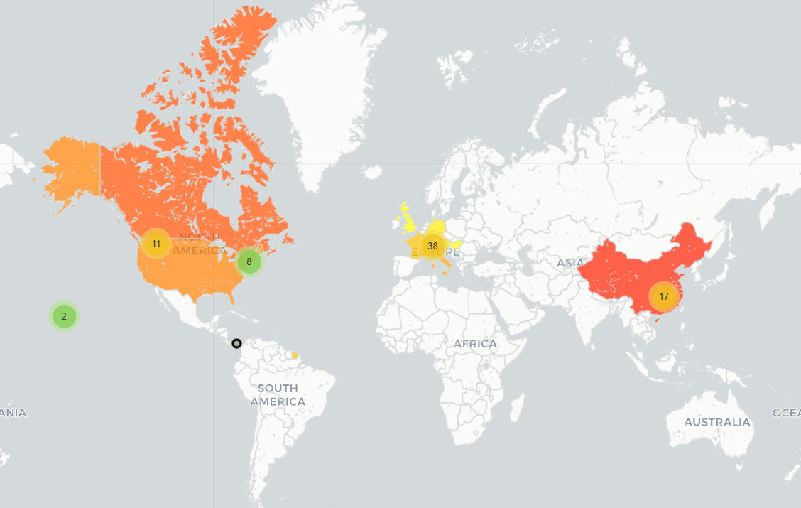

# Travel Map

- Install requirements:
```pip install -r requirements.txt```
- Get [Google service account credentials](https://console.cloud.google.com/iam-admin/serviceaccounts) and save it to `credentials.json` in the project root.
- Store Google spreadsheet id and maps api key in a `.env` file in the project root:
```
MAPS_API_KEY=<your-maps-api-key>
SHEETS_ID=<your-sheet-key>
```

Run:
```
python color_countries.py
```
Output: a map showing heatmap-style counts of the cities visited in each country.

